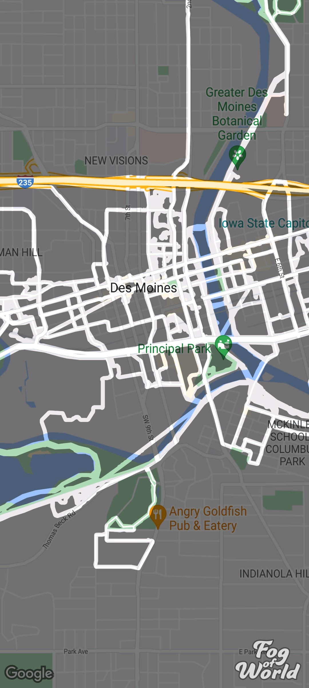

Title: Fog of World Clean Up
Date: 2023-04-08
Tags: Apps, Tracking
Slug: fog-of-world-clean-up
Author: Anthony Herrera
Summary: How to clean up maps in fog of world app

# Fog of World

The Fog of World app is a program for Android and iOS that allows you to record yourself
moving around the world. It is one of those applications that are almost stupid simple but
functional beautifully. It's also like $25 which seems ridiculous for how simple the app is,
but it also doesn't store / steal / sell your data.

As an example, here are all the places that I have been in Des Moines: 

## Problem

The problem that I had was bec